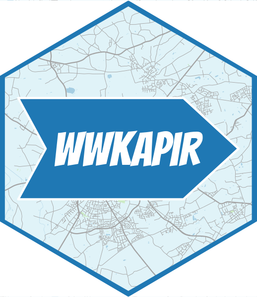
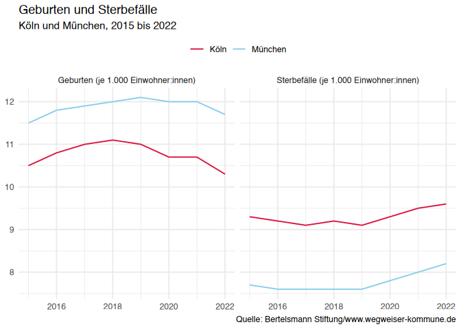

<!-- README.md is generated from README.Rmd. Please edit that file -->

<div align="center">

<a href='https://trekonom.github.io/rwwk/'></a>

</div>

📦 **rwwk** is an R package that provides functions to connect to and
retrieve data from the [Wegweiser Kommune Open Data REST
API](https://www.wegweiser-kommune.de/open-data). It simplifies
accessing municipal data for analysis, research, or reporting purposes.

## ✨ Features

- 📡 Simple functions to query the REST API
- 🔍 Search for available datasets, indicators, and metadata
- 🏙 Retrieve data for specific municipalities or time periods
- 📊 Return results as tidy `data.frame`s or tibbles

## 🛠 Installation

``` r
# From GitHub (requires devtools or remotes)
remotes::install_github("trekonom/rwwk")
```

## 🚀 Getting Started

This is an example on how to retrieve data on births and deaths in
Cologne and Munich, tidying the retrieved data and visualizing the data
using `ggplot2`:

``` r
library(rwwk)
library(ggplot2)

# Get data on births and deaths for Cologne and Munich
csv <- wwk_export(
  indicator = c("geburten", "sterbefaelle"),
  region = c("koeln", "muenchen")
)
dat <- wwk_read_csv(csv)
#> ℹ Using "','" as decimal and "'.'" as grouping mark. Use `read_delim()` for more control.
#> Warning: One or more parsing issues, call `problems()` on your data frame for details,
#> e.g.:
#>   dat <- vroom(...)
#>   problems(dat)

years <- paste(range(dat$year), collapse = " bis ")
regions <- paste(unique(dat$region), collapse = " und ")
ggplot(dat, aes(x = year, y = value, color = region, group = region)) +
  geom_line() +
  scale_color_manual(
    values = c("#DC143C", "#87CEEB")
  ) +
  facet_wrap(~indicator) +
  theme_minimal() +
  theme(legend.position = "top") +
  labs(
    title = "Geburten und Sterbefälle",
    subtitle = sprintf("%s, %s", regions, years),
    x = NULL, y = NULL, color = NULL,
    caption = "Quelle: Bertelsmann Stiftung/www.wegweiser-kommune.de"
  )
```



## 🔍 What is Wegweiser Kommune?

[Wegweiser Kommune](https://www.wegweiser-kommune.de/) is an initiative
by the Bertelsmann Stiftung offering open data and information to
support local authorities in Germany. It covers topics such as
demography, education, finances, health, and sustainability.

## ⚙️ API Reference

This package wraps the REST API documented here:  
📖 <https://www.wegweiser-kommune.de/open-data>

## 📜 Terms of Use

The data processed with this package originates from the platform
[Wegweiser Kommune](https://www.wegweiser-kommune.de).  
Please make sure to comply with the [Terms of
Use](https://www.wegweiser-kommune.de/nutzungsbedingungen) when
accessing or using data from this source.

> The contents of Wegweiser Kommune are provided free of charge by the
> Bertelsmann Stiftung. Due to different licensing conditions of the
> underlying raw data, which are supplied by various data holders, the
> indicators are made available under the [Data License Germany –
> Attribution – Version 2.0](https://www.govdata.de/dl-de/by-2-0).  
> Reproduction and distribution, even in part, must always include the
> source attribution: **“Bertelsmann
> Stiftung/www.wegweiser-kommune.de”**.

Users are responsible for ensuring that their use of the data adheres to
these conditions.
