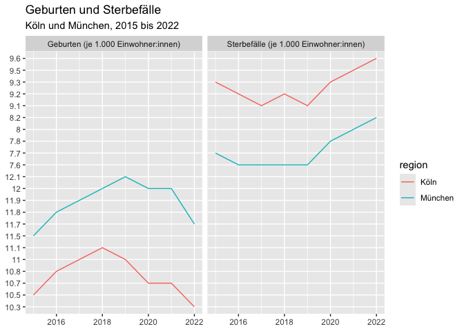

<!-- README.md is generated from README.Rmd. Please edit that file -->

# 📦 rwwk

**rwwk** is an R package that provides functions to connect to and
retrieve data from the [Wegweiser Kommune Open Data REST
API](https://www.wegweiser-kommune.de/open-data). It simplifies
accessing municipal data for analysis, research, or reporting purposes.

------------------------------------------------------------------------

## 🔍 What is Wegweiser Kommune?

[Wegweiser Kommune](https://www.wegweiser-kommune.de/) is an initiative
by the Bertelsmann Stiftung offering open data and information to
support local authorities in Germany. It covers topics such as
demography, education, finances, health, and sustainability.

------------------------------------------------------------------------

## ✨ Features

- 📡 Simple functions to query the REST API
- 🔍 Search for available datasets, indicators, and metadata
- 🏙 Retrieve data for specific municipalities or time periods
- 📊 Return results as tidy `data.frame`s or tibbles
- 🔄 Built-in support for pagination and error handling

------------------------------------------------------------------------

## 🛠 Installation

``` r
# From GitHub (requires devtools or remotes)
remotes::install_github("trekonom/rwwk")
```

------------------------------------------------------------------------

## 🚀 Getting Started

``` r
library(rwwk)

# List available topics or indicators
topics <- wwk_list_topic()
indicators <- wwk_list_indicator()
regions <- wwk_list_region()

# Retrieve data for one indicator and one region
csv <- wwk_export(
  indicator = "geburten",
  region = "koeln",
  year = 2020:2019
)
# Read data as a tidy tibble
dat <- wwk_read_csv(csv)
#> ℹ Using "','" as decimal and "'.'" as grouping mark. Use `read_delim()` for more control.
#> Warning: One or more parsing issues, call `problems()` on your data frame for details,
#> e.g.:
#>   dat <- vroom(...)
#>   problems(dat)

# Explore the data
head(dat)
#> # A tibble: 2 × 4
#>   indicator                            year region value
#>   <chr>                               <int> <chr>  <dbl>
#> 1 Geburten (je 1.000 Einwohner:innen)  2019 Köln    11  
#> 2 Geburten (je 1.000 Einwohner:innen)  2020 Köln    10.7
```

------------------------------------------------------------------------

## 📚 Available Functions

| Function | Description |
|----|----|
| `wwk_list_topic()` | List available topic categories |
| `wwk_list_indicator()` | List all indicators with metadata |
| `wwk_list_regions()` | List all regions with metadata |
| `wwk_export()` | Retrieve data for specified indicators, regions, and years |

------------------------------------------------------------------------

## 🧪 Example Use Case

``` r
library(rwwk)
library(ggplot2)
library(tidyr)
library(readr)

# Get data on births and deaths for Cologne and Munich
csv <- wwk_export(
  indicator = c("geburten", "sterbefaelle"),
  region = c("koeln", "muenchen")
)
dat <- wwk_read_csv(csv)
#> ℹ Using "','" as decimal and "'.'" as grouping mark. Use `read_delim()` for more control.
#> Warning: One or more parsing issues, call `problems()` on your data frame for details,
#> e.g.:
#>   dat <- vroom(...)
#>   problems(dat)

years <- paste(range(dat$year), collapse = " bis ")
ggplot(dat, aes(x = year, y = value, color = region, group = region)) +
  geom_line() +
  facet_wrap(~indicator) +
  labs(
    title = "Geburten und Sterbefälle",
    subtitle = sprintf("Köln und München, %s", years),
    x = NULL, y = NULL
  )
```



------------------------------------------------------------------------

## ⚙️ API Reference

This package wraps the REST API documented here:  
📖 <https://www.wegweiser-kommune.de/open-data>
